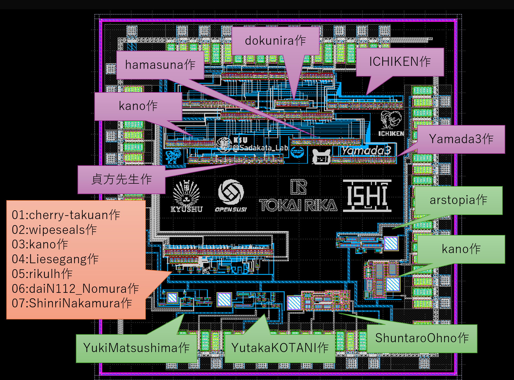

# ISHI会版OpenMPW TR10-2について
これは、[ISHI会版OpenMPW TR10-2](https://ishi-kai.org/openmpw/shuttle/tr10/2025/08/01/shuttle_ISHI-Kai_OpenMPW-TR10-2_start.html)にみんなで相乗りしたxschemによる回路図とklayoutによるレイアアウト置き場です。

## みんなの[相乗りチップ](Submitted/all_members_layout.gds)
- 
- 

### 相乗りチップのラベル
- オレンジ枠  
-- 初めてのInverter回路  
- 緑枠  
-- OPAMP回路  
- 紫枠  
-- 1bit-CPU回路  

## 謝辞
[九州大学大学院システム情報科学府附属価値創造型半導体人材育成センターが主催する2025年度実習シリーズでISHI会のインバータ回路ハンズオンが採用されました](https://ishi-kai.org/seminar/2025/07/15/Seminar_KyushuUniv_inverter.html)の試験運用の一環として実施されたシャトルとなります。  
また、1bit-CPUハンズオンの試験運用は、[九州産業大学の貞方先生](https://ras2.kyusan-u.ac.jp/kyshp/KgApp/k05/resid/S001627/863)の協力のもと、実施しました。  

- [九州大学が採択された「文科省の半導体人材育成の拠点校」に利用予定のハンズオンの試験運用をしてきました](https://ishi-kai.org/seminar/2025/09/26/Seminar_KyushuUniv_Adopted.html)
- 

# 参加者リスト
ISHI会版OpenMPW TR10-2は全16人による全18デザインの投稿がありました。  

## [Inverter回路](https://github.com/ishi-kai/ISHI-KAI_Multiple_Projects_OpenMPW_TR10-2#inverter%E5%9B%9E%E8%B7%AF%E5%8F%82%E5%8A%A0%E8%80%85)
- [cherry-takuan](https://github.com/ishi-kai/ISHI-KAI_Multiple_Projects_OpenMPW_TR10-2#cherry-takuan%E3%81%AE%E5%9B%9E%E8%B7%AF)
- [daiN112_Nomura](https://github.com/ishi-kai/ISHI-KAI_Multiple_Projects_OpenMPW_TR10-2#dain112_nomura%E3%81%AE%E5%9B%9E%E8%B7%AF)
- [kano](https://github.com/ishi-kai/ISHI-KAI_Multiple_Projects_OpenMPW_TR10-2#kano%E3%81%AE%E5%9B%9E%E8%B7%AF)
- [Liesegang](https://github.com/ishi-kai/ISHI-KAI_Multiple_Projects_OpenMPW_TR10-2#liesegang%E3%81%AE%E5%9B%9E%E8%B7%AF)
- [rikulh](https://github.com/ishi-kai/ISHI-KAI_Multiple_Projects_OpenMPW_TR10-2#rikulh%E3%81%AE%E5%9B%9E%E8%B7%AF)
- [wipeseals](https://github.com/ishi-kai/ISHI-KAI_Multiple_Projects_OpenMPW_TR10-2#wipeseals%E3%81%AE%E5%9B%9E%E8%B7%AF)
- [ShinriNakamura](https://github.com/ishi-kai/ISHI-KAI_Multiple_Projects_OpenMPW_TR10-2#shinrinakamura%E3%81%AE%E5%9B%9E%E8%B7%AF)

## [OPAMP回路](https://github.com/ishi-kai/ISHI-KAI_Multiple_Projects_OpenMPW_TR10-2#opamp%E5%9B%9E%E8%B7%AF%E5%8F%82%E5%8A%A0%E8%80%85)
- [arstopia](https://github.com/ishi-kai/ISHI-KAI_Multiple_Projects_OpenMPW_TR10-2#arstopia%E3%81%AE%E5%9B%9E%E8%B7%AF)
- [kano](https://github.com/ishi-kai/ISHI-KAI_Multiple_Projects_OpenMPW_TR10-2#kano%E3%81%AE%E5%9B%9E%E8%B7%AF-1)
- [ShuntaroOhno](https://github.com/ishi-kai/ISHI-KAI_Multiple_Projects_OpenMPW_TR10-2#shuntaroohno%E3%81%AE%E5%9B%9E%E8%B7%AF)
- [YukiMatsushima](https://github.com/ishi-kai/ISHI-KAI_Multiple_Projects_OpenMPW_TR10-2#yukimatsushima%E3%81%AE%E5%9B%9E%E8%B7%AF)
- [YutakaKOTANI](https://github.com/ishi-kai/ISHI-KAI_Multiple_Projects_OpenMPW_TR10-2#yutakakotani%E3%81%AE%E5%9B%9E%E8%B7%AF)
- [3zki](https://github.com/ishi-kai/ISHI-KAI_Multiple_Projects_OpenMPW_TR10-2#3zki%E3%81%AE%E5%9B%9E%E8%B7%AF)

## [1bit-CPU回路](https://github.com/ishi-kai/ISHI-KAI_Multiple_Projects_OpenMPW_TR10-2#1bit-cpu%E5%9B%9E%E8%B7%AF%E5%8F%82%E5%8A%A0%E8%80%85)
- [ICHIKEN](https://github.com/ishi-kai/ISHI-KAI_Multiple_Projects_OpenMPW_TR10-2#ichiken%E3%81%AE%E5%9B%9E%E8%B7%AF)
- [九州産業大学の貞方先生](https://github.com/ishi-kai/ISHI-KAI_Multiple_Projects_OpenMPW_TR10-2#%E4%B9%9D%E5%B7%9E%E7%94%A3%E6%A5%AD%E5%A4%A7%E5%AD%A6%E3%81%AE%E8%B2%9E%E6%96%B9%E5%85%88%E7%94%9F%E3%81%AE%E5%9B%9E%E8%B7%AF)
- [Yamada3](https://github.com/ishi-kai/ISHI-KAI_Multiple_Projects_OpenMPW_TR10-2#yamada3%E3%81%AE%E5%9B%9E%E8%B7%AF)
- [hamasuna](https://github.com/ishi-kai/ISHI-KAI_Multiple_Projects_OpenMPW_TR10-2#hamasuna%E3%81%AE%E5%9B%9E%E8%B7%AF)
- [kano](https://github.com/ishi-kai/ISHI-KAI_Multiple_Projects_OpenMPW_TR10-2#kano%E3%81%AE%E5%9B%9E%E8%B7%AF-2)
- [dokunira](https://github.com/ishi-kai/ISHI-KAI_Multiple_Projects_OpenMPW_TR10-2#dokunira%E3%81%AE%E5%9B%9E%E8%B7%AF)

## 各種リスト
- [ピンリスト](docs/pin_list.pdf)

# Inverter回路参加者
[2025年09月イベント：初めての半導体設計・製造体験！一日で作るインバータ回路ハンズオン](https://ishikai.connpass.com/event/363093/)での成果物です。  

## 回路図とGDSファイル
- [参加者のインバータ回路置き場](./member_project/inverter/)
- [MUX化したインバータ回路置き場](./member_project/inverter_MUX/)
-- 今回はピン数の都合で8chのマルチプレクサ/デマルチプレクサを使って実装しています。

## [cherry-takuan](./member_project/inverter/cherry-takuan/)の回路

- [感想と回路図とGDS置き場](./member_project/inverter/cherry-takuan/)

## [daiN112_Nomura](./member_project/inverter/daiN112_Nomura/)の回路

- [感想と回路図とGDS置き場](./member_project/inverter/daiN112_Nomura/)

## [kano](./member_project/inverter/kano/)の回路

- [感想と回路図とGDS置き場](./member_project/inverter/kano/)

## [Liesegang](./member_project/inverter/Liesegang/)の回路

- [感想と回路図とGDS置き場](./member_project/inverter/Liesegang/)

## [rikulh](./member_project/inverter/rikulh/)の回路

- [感想と回路図とGDS置き場](./member_project/inverter/rikulh/)

## [wipeseals](./member_project/inverter/wipeseals/)の回路

- [感想と回路図とGDS置き場](./member_project/inverter/wipeseals/)

## [ShinriNakamura](./member_project/inverter/ShinriNakamura/)の回路

- [回路図とGDS置き場](./member_project/inverter/ShinriNakamura/)

# OPAMP回路参加者
[2025年09月イベント：二日でOPAMP回路ハンズオン](https://ishikai.connpass.com/event/363412/)での成果物です。  
インバータ回路を終えて、中級者への道の第一歩としてのハンズオンです。  

## 設計方針と回路図とGDSファイル
- [参加者のOPAMP回路置き場](./member_project/OPAMP/)

## [arstopia](./member_project/OPAMP/arstopia/)の回路

- [設計方針と回路図とGDS置き場](./member_project/OPAMP/arstopia/)

## [kano](./member_project/OPAMP/kano/)の回路

- [設計方針と回路図とGDS置き場](./member_project/OPAMP/kano/)

## [ShuntaroOhno](./member_project/OPAMP/ShuntaroOhno/)の回路

- [設計方針と回路図とGDS置き場](./member_project/OPAMP/ShuntaroOhno/)

## [YukiMatsushima](./member_project/OPAMP/YukiMatsushima/)の回路

- [設計方針と回路図とGDS置き場](./member_project/OPAMP/YukiMatsushima/)

## [YutakaKOTANI](./member_project/OPAMP/YutakaKOTANI/)の回路

- [設計方針と回路図とGDS置き場](./member_project/OPAMP/YutakaKOTANI/)

## [3zki](./member_project/OPAMP/3zki/)の回路
Rail to Rail OPAMPです。  
レイアウトもかなり工夫されたものになっており、上級者になりたい方は是非参考にしてみてください。  

- [回路図とGDS置き場](./member_project/OPAMP/3zki/)

# 1bit-CPU回路参加者
ロジック（デジタル）回路の中級編の1bit-CPUハンズオンです。  
学習内容は、「CPUやGPUのようなデジタル回路は「HDL（ハードウェア記述言語）で設計する」わけだけど、それがどうやって半導体になっているのか？を体験して理解するという内容です。  
今回は、[九州産業大学の貞方先生](https://ras2.kyusan-u.ac.jp/kyshp/KgApp/k05/resid/S001627/863)の協力のもと、試験運用を実施しました。  

- [1bit-CPUサンプル](https://github.com/ishi-kai/openmpw-transistor-level-examples/tree/main/TR10/1bit-CPU)
- [1bit-CPU設計資料](https://github.com/ishi-kai/openmpw-transistor-level-examples/blob/main/TR10/docs/1bit-CPU_TR10.pdf)

## 回路図とGDSファイル
- [参加者の1bit-CPU回路置き場](./member_project/1bit-CPU/)
- [MUX化した1bit-CPU回路置き場](./member_project/1bit-CPU_ALL/)
-- 今回はピン数の都合で4chのマルチプレクサ/デマルチプレクサを2段で使って実装しています。

## [ICHIKEN](./member_project/1bit-CPU/ICHIKEN/)の回路
[電気系ものづくりYouTuberのイチケンさん](https://www.youtube.com/@ICHIKEN1)がレイアウトした1bit-CPUとなります。  

- [回路図とGDS置き場](./member_project/1bit-CPU/ICHIKEN/)

## [九州産業大学の貞方先生](./member_project/1bit-CPU/sadakata/)の回路
[九州産業大学の貞方先生](https://ras2.kyusan-u.ac.jp/kyshp/KgApp/k03/resid/S001627)がレイアウトした1bit-CPUとなります。  

- [回路図とGDS置き場](./member_project/1bit-CPU/sadakata/)

## [Yamada3](./member_project/1bit-CPU/yamada3/)の回路
主婦のYamada3がレイアウトした1bit-CPUとなります。  

- [回路図とGDS置き場](./member_project/1bit-CPU/yamada3/)

## [hamasuna](./member_project/1bit-CPU/hamasuna/)の回路
九州大学の学生であるhamasunaがレイアウトした1bit-CPUとなります。  

- [回路図とGDS置き場](./member_project/1bit-CPU/hamasuna/)

## [kano](./member_project/1bit-CPU/kano/)の回路
九州大学の学生であるkanoがレイアウトした1bit-CPUとなります。  

- [回路図とGDS置き場](./member_project/1bit-CPU/kano/)

## [dokunira](./member_project/1bit-CPU/dokunira/)の回路
東京大学の学生であるdokuniraがレイアウトした最小サイズクラスの1bit-CPUとなります。  

- [回路図とGDS置き場](./member_project/1bit-CPU/dokunira/)

# 測定会
2026年2月、チップ到着予定。  
