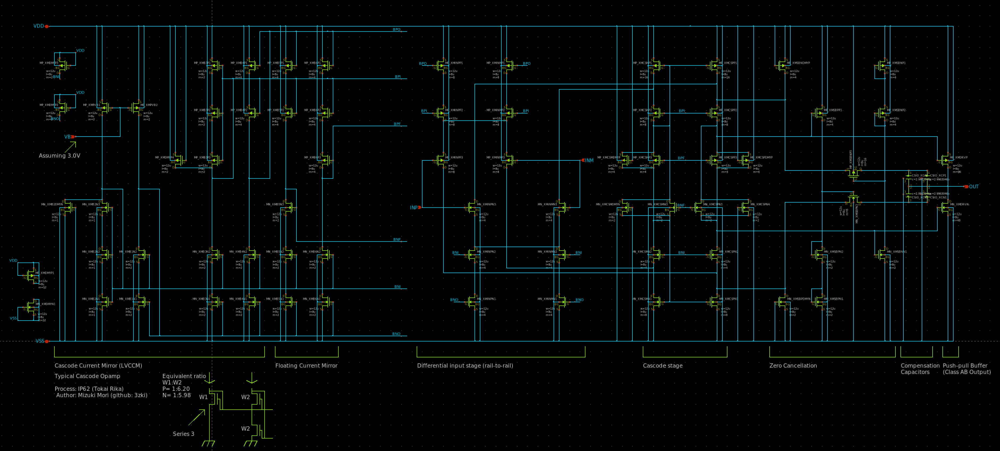
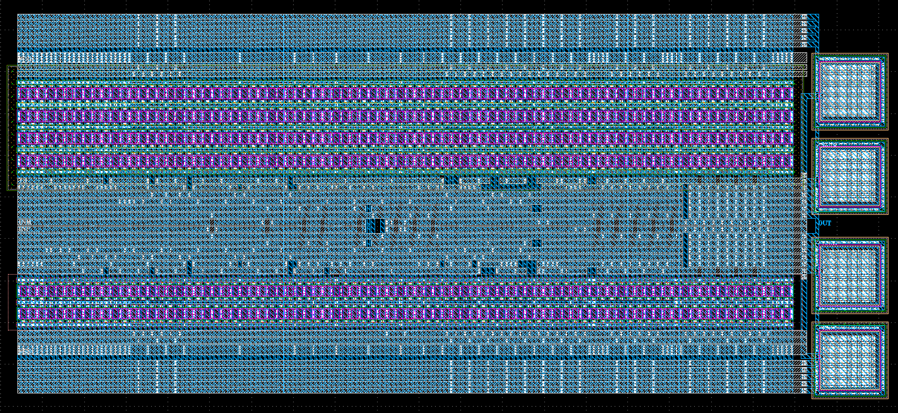
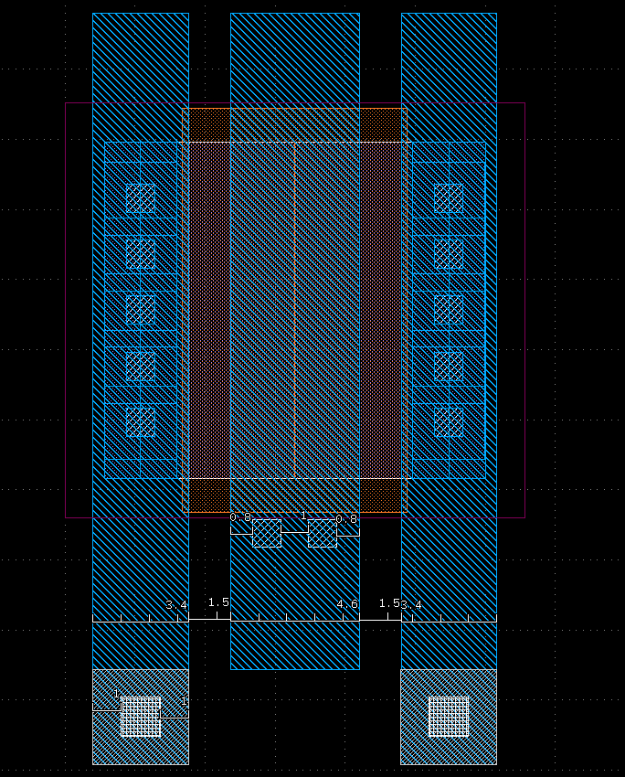

# 概要
Rail-to-Railなオペアンプを作りました。

[OpenGFMPW-1](https://github.com/ishi-kai/ISHI-KAI_Multiple_Projects_OpenGFMPW-1)で応募した（が落選した）Rail-to-railオペアンプをベースに設計しています。

"CMOS Circuit Design, Layout, and Simulation" (Figure 24.48) by R. Jacob Baker.

# 回路図

# レイアウト

# 設計方針
物理的（レイアウトの）設計方針として、以下を掲げました。
- シングルVIAはなるべく避け、VIA2個打ちを徹底する
  - ゲート長は横方向に2個VIAが打てるゲート長と配線幅かつ、メタル配線の最小間隔　よりも長いものとする
  - メタル間配線はW方向に2個VIAを打つこととする
- VIAとCONTのスタックが禁止されているため、ゲート配線と拡散層配線は同じ方向（W方向）に出し、網目状とする
  - M1がW方向、M2がL方向の配線を徹底する

上記条件を加味してレイアウトを描いたところL=7.8uが最小長であることがわかったため、今回はキリの良い数字としてL=8uを基準に設計しました。

Wは8uで設計したところ最後段バッファのパワー不足を感じたため12uとしました。特に大きな理由は無いと言えばその通りです。

# 感想
レイアウトの配置配線作業がかなり大変でした。

どこにどのトランジスタを割り当てたか、どういう配線をしようとして回路図を引いたかを思い出す時間がもったいないので、Xschemでレイアウトっぽいシンボルを作ってフロアプランを考えてメモをしたぐらいにはしんどかったです。

当初は計装アンプを作りたかったのですがオペアンプ単体のサイズがかなり大きく、レイアウトも難産だったためオペアンプ単体のTOとなりました。

次回こそは計装アンプに挑戦したいと思います。
