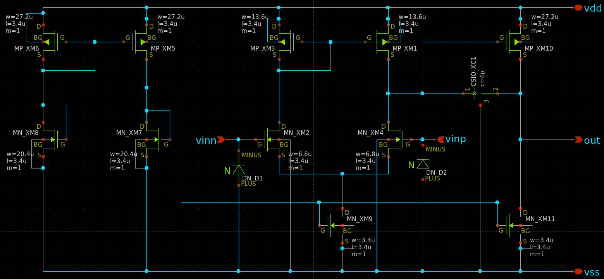
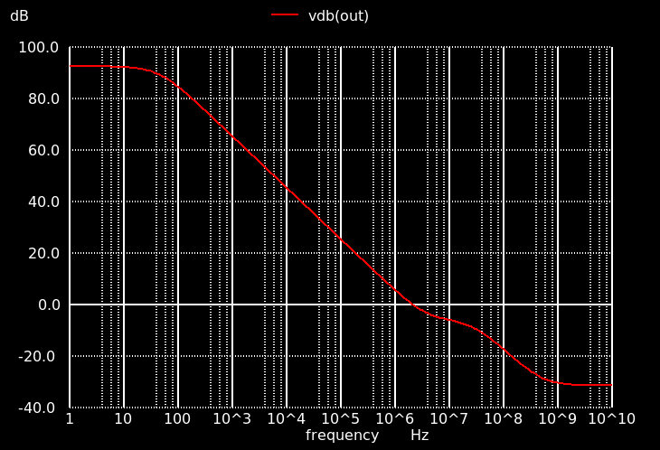
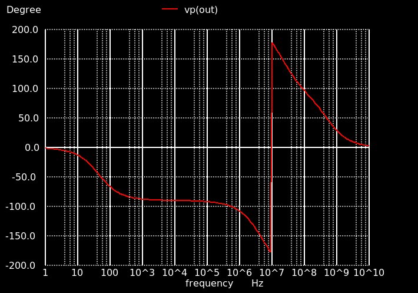
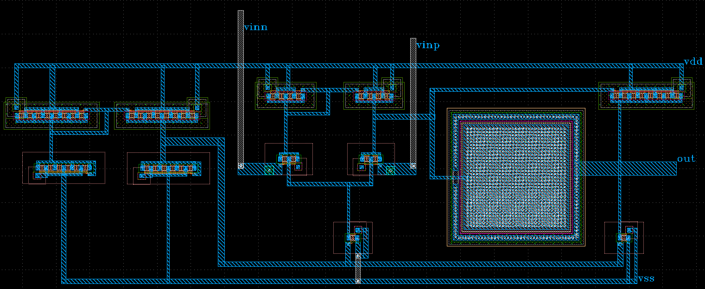

## 参加イベント
[ISHI会版OpenMPW TR10-2の OPAMPのグループワーク](https://ishi-kai.org/openmpw/shuttle/tr10/2025/08/01/shuttle_ISHI-Kai_OpenMPW-TR10-2_start.html)
　
## 感想
Yuki Matsushima  
一度はアナログ回路設計＆テープアウトをちゃんと経験してみたいと思っており、今回参加させていただきました。大学ではFPGAを用いて論理回路の設計をしているのですが、アナログ回路やレイアウトは学部の講義で少し触った以来で、最低限の知識しか持ち合わせていない状態でしたがなんとかレイアウト設計まで終えることができました。やはりアナログ回路の設計からレイアウトまでを経験すると視野がぐっと広がったような気がします。インターンや論文、学会等もあり当初の予定通りに進めることができなかったですが、過去の資料等があったおかげもあり、なんとか完成させることができてよかったです。このような貴重な機会をいただきありがとうございました。

B  
回路からレイアウトまでを一貫して設計するのは今回初めてでした。
チップの測定結果が楽しみです！
貴重な機会をいただきありがとうございました。  

Reo  
トラブルにより途中からサポートにまわりましたが、詳しい素子の特性や製造過程も考慮した設計は面白かったです。  
大学にいるだけでは味わえない貴重な経験をさせていただき、ありがとうございました。

## 回路図

オペアンプの設計にはCQ出版から出ている谷口先生のCMOSアナログ回路入門と土屋先生の講義(Ishi会のYoutubeにアーカイブが載っています)を参考に設計しました。またこのほかにもIshi会のgithubには回路設計やレイアウトの助けになる情報が様々あるので、困ったときは一度見てみると良いと思います。
ちなみに電流源はポートを出して外部供給することもできるそうなので、こだわりがなければ外部供給するのも良いと思います。これでbiasをいじることもできるので多少設計に失敗していてもリカバーできます。

## オープンループ特性

## レイアウト

DRCとLVSはかなり苦労しました。レイアウトで躓いたときはまず最新のPDKをインストールする。それでもエラーが続く場合は、リファレンスマニュアルやガイドラインをもう一度よく読んでみると良いと思います。これらをしっかり読んでみると、普通に見落としていたり、あるいは合っていると思い込んでいた箇所が実は間違っていたことに気づいたりします。私たちは、BGは必ずNMOSならvss, PMOSならvddにつながなければいけないことや、ゲート保護用のダイオードをつけることなどを見逃しており、かなり時間を使ってしまいました。

