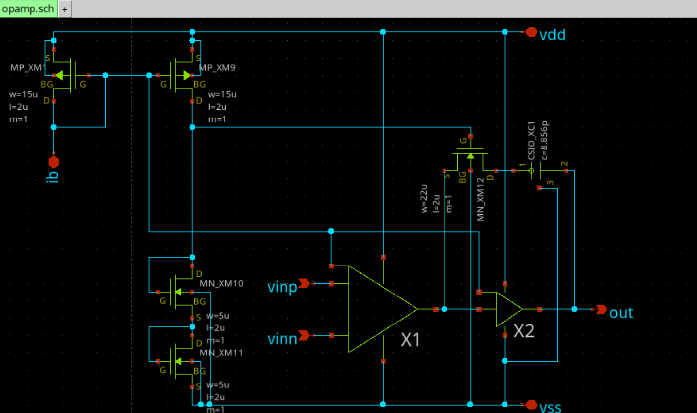

# 2025年09月イベント：二日でOPAMP回路ハンズオン

## 概要
二日でアナログ回路設計基本知識からOPAMPの各種部品解説・設計までを一気にやる企画です。

## イベントページ
https://ishikai.connpass.com/event/363412/

## スクリーンショット
- OPAMP回路 `opamp.sch`

- 差動増幅部(X1) `diff.sch`

- ソース接地増幅回路部(X2) `cs.sch`

- 電圧利得周波数特性 `opamp_ac.sch`

- 位相周波数特性 `opamp_ac.sch`

- レイアウト `opamp.gds`

## 説明

### 設計について
 - ハンズオンで頂いたサンプル回路図をベースに、回路定数を変更する方式で設計を行った。今回はL=2umとした。
 - 最終的な性能は以下の通り。(`opamp_ac.sch`による結果)
   - 利得: 65.2[dB]@1KHz
   - ユニティ・ゲイン周波数: 9.08[MHz]
   - 位相余裕: 38.0[deg]
 - レイアウト
   - 要求仕様: 600[um]x200[um]
   - 線幅3.4[um]を基本として配線を行った。
 - 使用ツール
   - 回路図作成: xschem
   - 回路シミュレータ: ngspice
   - レイアウト: klayout

### 工夫したポイント
- マルチフィンガーを用い、必要な部分ではMOSFETのWをできるだけ大きくすることを目指した。
- MOSFETをできるだけ対称になるように配置してみた。

### 苦労したポイント
- とにかくDRC/LVSが通らない。。。要求仕様の600[um]x200[um]にはなんとか収まったが、素子の位置を後からいじるとそれに依存した配線を直すのが想像以上に大変だった。
- 今回、ガードリング、ダブルビア、コモンセントロイドなどのテクニックは入れられなかったので、機会があればトライしてみたい。また、設計についても詳細を見直してみたい。
