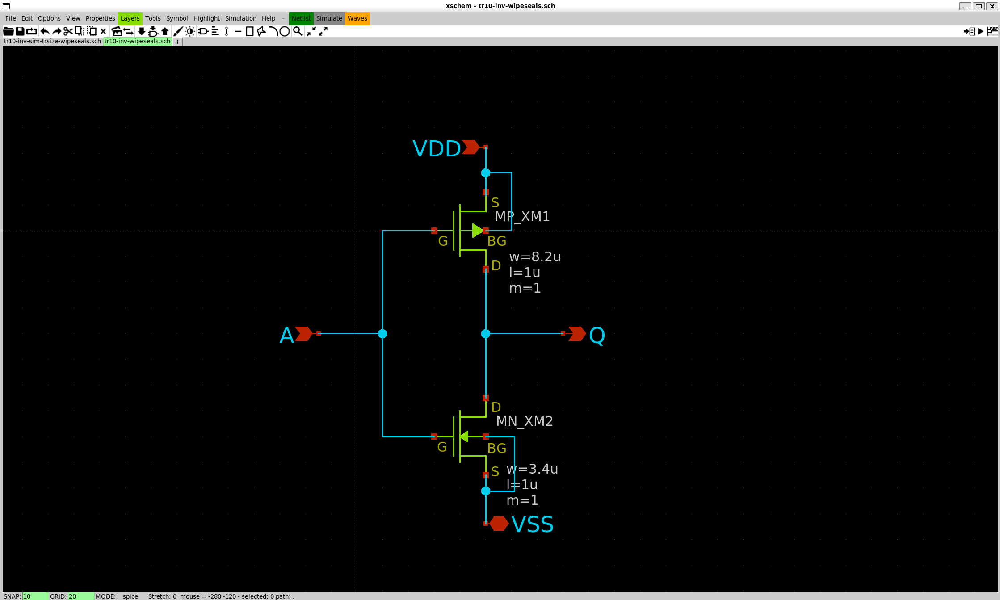
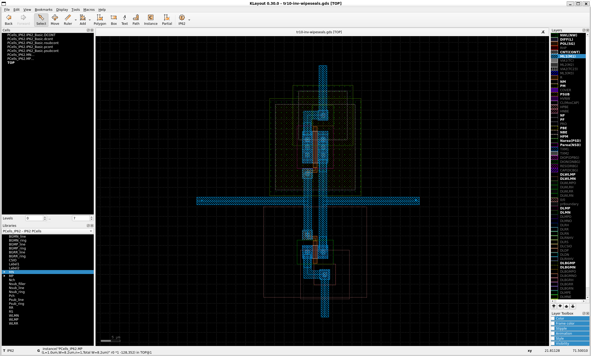

# TR10 Inverter by wipeseals

[2025 年 09 月イベント：初めての半導体設計・製造体験！一日で作るインバータ回路ハンズオン](https://ishikai.connpass.com/event/363093/) で作成したインバーターの回路図と半導体設計データです。

## 成果物

### 回路図 (xschem)

[`dist/tr10-inv-wipeseals.sch`](dist/tr10-inv-wipeseals.sch)

### 半導体設計データ (Klayout)

DRC, LVS Pass 確認済

[`dist/tr10-inv-wipeseals.gds`](dist/tr10-inv-wipeseals.gds)

## 感想

回路設計などは経験がありましたが、半導体設計は初めてでした。  
所々ハマりどころを整備いただいていて、スムーズにハンズオンを進めることができました。

設計を行われている方には当たり前かもしれませんが、出力特性を調整するためにトランジスタの物理レイアウトをいじっていくという発想自体がなかったので新鮮でした。（普段であればそれに見合う部品選定をする発想でした）

## 連絡先

`wipeseals+contact [at] gmail.com`
